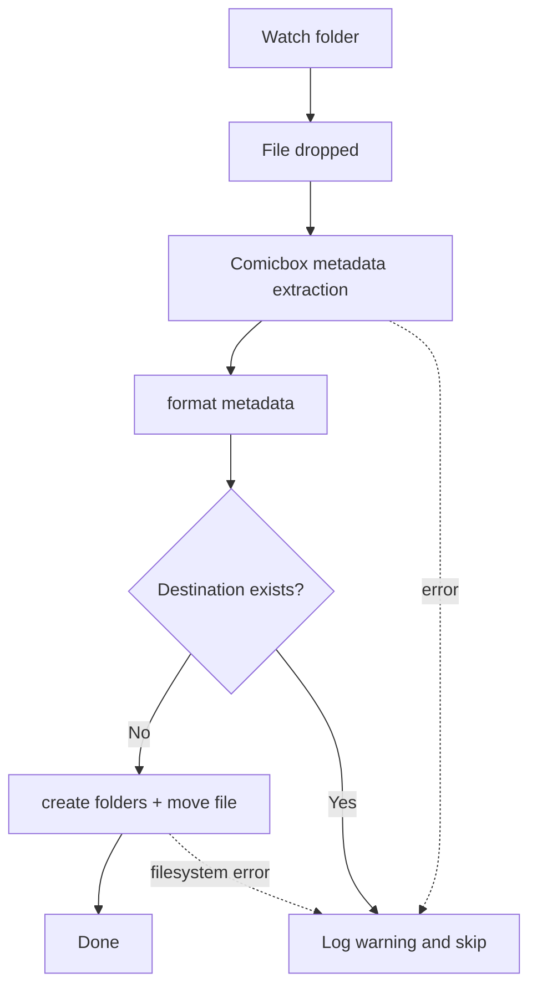

# comicbook-guy

A small helper to organise comic book files dropped into a watched inbox. Files are inspected (via ComicBox), metadata is extracted, a destination folder is built (Series[/Volume] / Filename) and the file is moved into the library.

---

**Status**: prototype — metadata extraction, destination building and safe moves implemented. The watcher entrypoint and basic logging exist.

**Requirements**
- Python 3.13+
- See `pyproject.toml` for declared dependencies. Key runtime libraries used in this repository include `comicbox`, `pydantic`, and `watchdog`.

You can install development/runtime deps via your preferred tooling (poetry/pip). For a quick manual install of main runtime dependencies:

```bash
python -m pip install comicbox pydantic watchdog
```

**Quick usage**

Run the watcher (this starts a filesystem observer that watches the configured inbox):

```bash
python -m comicbookguy.main
```

Or call the organiser directly from Python to try a single file:

```bash
python -c "from pathlib import Path; from comicbookguy.services.organiser import restructure_file; print(restructure_file(Path('/path/to/library'), Path('/tmp/example.cbz')))"
```

Replace `/path/to/library` and `/tmp/example.cbz` with your paths.

**Example flow**



**Files of interest**

- `comicbookguy/main.py` — watcher entrypoint (starts `ComicbookHandler`).
- `comicbookguy/services/organiser.py` — `restructure_file()` that orchestrates extraction and moving.
- `comicbookguy/services/metadata_lookup.py` — extracts metadata using `comicbox` and normalises fields.
- `comicbookguy/utils/utils.py` — builds destination folder and filename (`organise_comic`).
- `comicbookguy/models/comic.py` — `ComicMetadata` model (Pydantic) describing extracted fields.

**Behaviour & errors**
- `restructure_file()` is defensive: on any unexpected error it logs the exception and returns `None`, leaving the original file in place so a watcher can retry later.
- The watcher only processes files with supported extensions (`.cbz`, `.cbr`) and checks that a file is stable before processing.
- Moves currently use `shutil.move` and the code avoids overwriting existing destinations.

**Next steps / suggestions**
- Add unit tests for `metadata_lookup` and `organise_comic`.
- Add a small CLI wrapper (console script) to expose `main()` under a project command name.
- Add CI and a `requirements` or `poetry.lock` file for reproducible installs.

---
